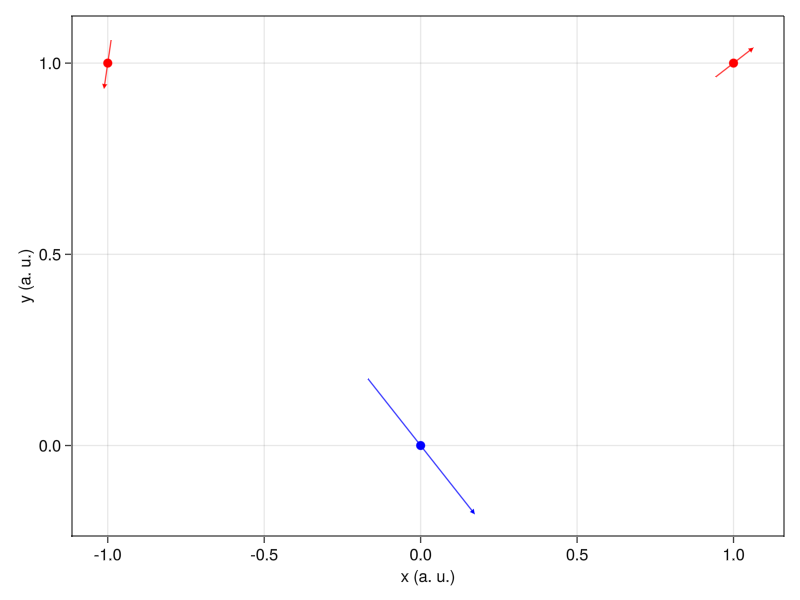

# ParticlePCARepresentation

This is a simple utility package to apply PCA on data representing
particles and to visualize it.
The visualization is done by describing the "effect" of a component on
a particle by an arrow on the particle.
The direction and relative length of the arrows thus inform on the shape
of the associated collective motion.

## Example (random data)



## Usage

### Installation

Once you have [Julia](https://julialang.org),
open the REPL in package mode (using `]`) and type

```
add GLMakie https://github.com/Kolaru/ParticlePCARepresentation.jl
```

Then you will be able to run the examples in the `example` folder.

### Functions

Firstly we provide the `ParticlePCA` type that compute PCA for data shaped
in a `(ndims x nparticles x nobs)` array.
It also allows to retrieve the components (using the `projection`) function
as an `(ndims x nparticles x ncomps)` array.
Internally the PCA is performed by concatenating the first two dimensions,
that is by erasing the information that the data represents particles.

We also provide the functions `plot_component2D` and `plot_component3D`
to plot the PCA using the above mentioned representation in 2D
(projected on two axes) or 3D.
The example use `GLMakie.jl` but any of the `Makie.jl` backend should work.